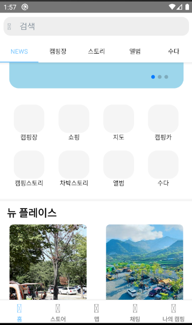
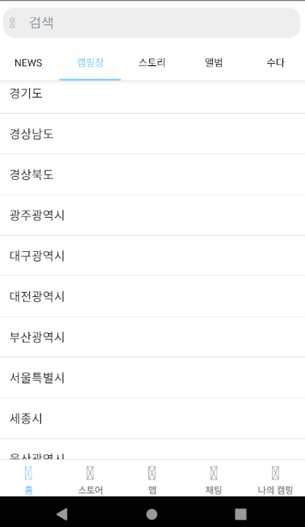
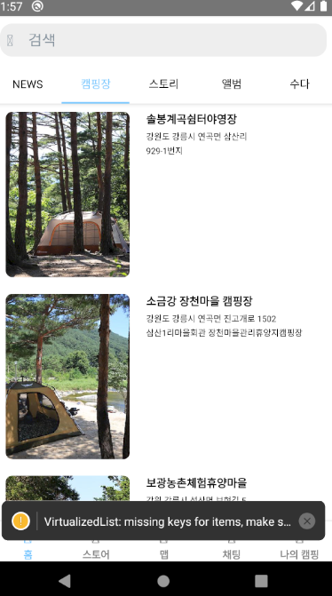
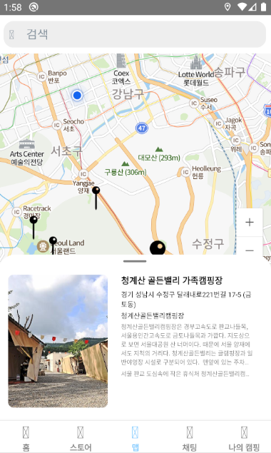

&nbsp;





## 1. 시작하기

##### Run Server - [http://localhost:5000](http://localhost:5000)
```
python main.py
```


## 2. 개발 레퍼런스

##### Alembic
- Database migrations tool for SQLAlchemy
- 참고 사이트: [https://alembic.sqlalchemy.org/](https://alembic.sqlalchemy.org/)

##### Flask
- Framework
- 참고 사이트: [http://flask.pocoo.org/](http://flask.pocoo.org/)

##### ReactNative
- Database ORM
- 참고 사이트: [https://reactnative.dev/](https://reactnative.dev/)


## 3. 디렉토리 기본 구조

```
.
+-- api                      // api 디렉토리
|   +-- src                  
|   |   +-- apis             // api 
|   |   +-- migrate          // alembic migrate
|   |   +-- query            // sql 
|   |   --- alembic.ini      // alembic file
|   --- requirements.py      // install file
+-- client                   // client 디렉토리
|   +-- android              // android 디렉토리
|   +-- ios                  // ios 디렉토리
|   +-- src                  
|   |   +-- @type            // types file 
|   |   +-- component        // component 디렉토리  
|   |   +-- images           // image 디렉토리 
|   |   +-- navigation       // navigation 디렉토리
|   |   +-- store            // redux 디렉토리 (액션타입, 액션, 리듀서) 
|   --- package.json         // install file
+-- fdata                    // fdata
--- README.md
```

